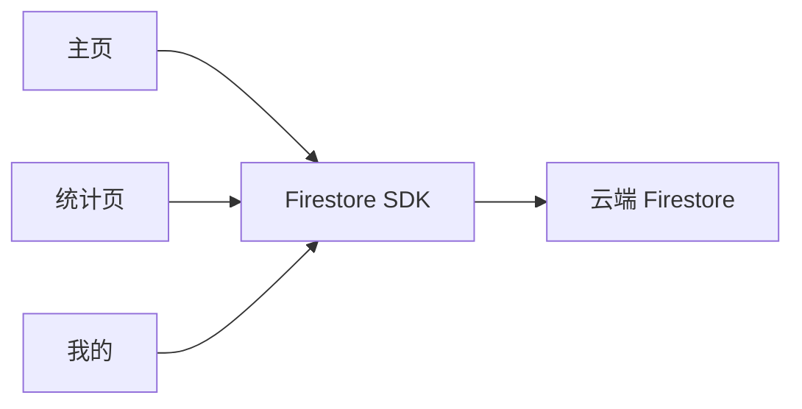

# 日程管理 App 功能文档

## 页面总览

App 采用底部 Tab 导航，共 3 个页面：

```
┌──────────┬──────────┬──────────┐
│   主页    │  统计页   │   我的   │
└──────────┴──────────┴──────────┘
```

| 页面 | 定位 |
|------|------|
| 主页 | 日程的查看与操作入口，覆盖全部日程功能 |
| 统计页 | 日程数据汇总，掌握完成情况与分布 |
| 我的 | 账号与设置，导出数据 |

---

## 一、主页

> 核心页面，日程的"日常使用场所"。

### 有什么东西（内容）

| 区域 | 内容 |
|------|------|
| 顶部栏 | 问候语 + 当前日期；右侧搜索图标 |
| 今日概览卡片 | 今日日程条数、距离下一条日程的开始时间 |
| 视图切换 | 列表 / 甘特图 / 日历 三种视图 Tab |
| 日程列表 | 按「今天 / 明天 / 之后」分组，每项显示标题、起止时间、状态标签、分类颜色 |
| 筛选栏 | 按状态（全部/待办/进行中/已完成）、按分类筛选 |
| 悬浮按钮 | 右下角「+」，快速新建日程 |

### 能干什么（功能）

| 功能 | 说明 |
|------|------|
| 查看日程 | 列表/甘特图/日历三种视图自由切换；离线时也能查看（本地缓存） |
| 搜索日程 | 按标题/描述关键字搜索 |
| 新建日程 | 填写标题、描述、起止时间、分类、颜色标记 |
| 编辑日程 | 点击条目进入详情，修改任意字段，保存后实时同步 |
| 删除日程 | 滑动删除或长按删除，带确认弹窗 |
| 状态流转 | 一键切换：待办 → 进行中 → 已完成 |
| 刷新 | 下拉刷新拉取最新数据 |

---

## 二、统计页

> 数据看板，展示日程的整体情况。

### 有什么东西（内容）

| 区域 | 内容 |
|------|------|
| 统计周期切换 | 本周 / 本月 / 全年 |
| 概览卡片 | 总日程数、已完成数、完成率（进度环） |
| 状态分布 | 待办 / 进行中 / 已完成 的数量对比 |
| 分类占比 | 各分类的日程数量占比（环形图） |
| 完成趋势 | 按周期展示每日/每周完成数量（柱状图） |

### 能干什么（功能）

| 功能 | 说明 |
|------|------|
| 查看统计 | 各项数据随统计周期切换实时变化 |
| 点击联动 | 点击某分类或状态，可跳回主页并自动应用对应筛选 |

---

## 三、我的

> 账号与个人中心。

### 有什么东西（内容）

| 区域 | 内容 |
|------|------|
| 账号区域 | 未登录：显示「登录 / 注册」入口；已登录：显示邮箱、注册时间 |
| 功能列表 | 导出日程、数据同步状态、关于 |

### 能干什么（功能）

| 功能 | 说明 |
|------|------|
| 创建账号 | 使用邮箱创建账号 |
| 登录 / 退出 | 邮箱密码登录；退出登录后本地数据保留（离线缓存） |
| 导出日程 | 将当前账号的日程导出为 TXT 文件（标题、描述、起止时间、状态、分类） |
| 查看同步状态 | 显示当前网络状态及离线待同步数量 |

---

## 数据流向



- 三个页面共享同一份 Firestore 数据，任何一端修改，其他端实时刷新。
- 断网时数据来自本地缓存，联网后自动同步。
